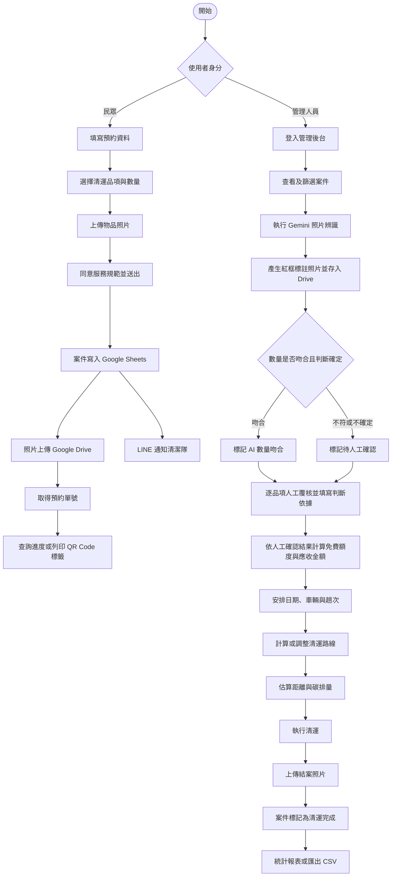

# 大型廢棄傢俱預約清運管理系統

這是一套以繁體中文呈現的線上清運預約與清潔隊派車管理網站，提供民眾填寫大型廢棄傢俱清運申請、上傳現場照片、查詢案件進度及列印清運標籤；管理端則可審核案件、安排車輛與趟次、調整清運路線、記錄碳排估算、拍照結案及匯出 CSV。

網站前端可直接部署至 GitHub Pages，正式資料則透過 Google Apps Script（GAS）串接 Google Sheets 與 Google Drive。瀏覽器的 `localStorage` 同時作為本機快取，讓介面在開發或暫時無法連線時仍保留部分資料。

## 目前版本重點與資料檢視結果

本文件已依目前程式重新核對。現行建置包含三個入口：民眾端 `index.html`、管理端 `admin.html` 與現場人員端 `work.html`。正式案件以 Google Sheets 為準，申請照片、AI 紅框標註照片及結案照片存放在 Google Drive；前端快取不能視為正式紀錄。

目前 AI 覆核採「機器建議、人工決定」原則：Gemini 可以辨識多張照片、合併計數並提供框選座標，但 AI 件數不會直接成為計費件數。只要尚未完成逐品項人工核可，後端會將本次計費件數與應收金額維持為 0，管理端也會禁止排班。這項限制同時存在於後端資料寫入與前端操作流程，不只是畫面警告。

> **版本邊界：** `google_apps_script.gs` 含正式環境識別碼且受 `.gitignore` 保護，因此 GitHub 只會保存前端與文件。本機修改 GAS 後，仍須由維護人員複製到 Apps Script、完成授權並重新部署，線上 `/exec` 才會更新。

## 主要功能

### 民眾端

- 填寫申請人姓名、電話、Email、地址及希望清運時段。
- 選擇床墊、櫃子、桌子、椅子、電視、冰箱或其他大型物品，並設定數量。
- 上傳多張待清運物品照片並於送出前預覽。
- 閱讀並同意服務對象、搬運放置、清運標示、危險物品及個資保護等規範。
- 產生民國年格式的預約單號，例如 `115-0816-001`。
- 依預約單號、姓名或電話查詢案件與狀態歷程。
- 自行取消尚未完成的預約。
- 列印含 QR Code 的清運識別標籤；掃描後可直接開啟該案件查詢頁。

### 清潔隊管理端

- 以後台密碼登入，登入狀態預設保留 30 分鐘。
- 查看總案件數、待審核、已排班及已完成數量。
- 新增、移除及快取可派遣車號。
- 將案件分配至指定車輛、日期、上午／下午時段及第幾趟。
- 依同車、同日、同時段及同趟次群組案件。
- 使用 Gemini 合併辨識多張申請照片，比對照片物件數量與民眾申報數量，並保留人工覆核。
- 將 Gemini 框選座標疊加至原始照片，以紅框、品名、信心值及可見特徵產生 Drive JPEG 備查圖。
- 並列顯示民眾申報、AI 結果、不確定性、原始照片與 AI 標註照片。
- 逐品項輸入人工確認數量並填寫判斷依據；未核可前不計費且禁止排班。
- 建議或自訂停靠順序，透過 GAS 計算路線距離與時間。
- 依柴油排放係數估算行程碳排量。
- 更新案件為已排班、清運完成或已取消，並保留狀態歷程。
- 上傳清運完成照片至 Google Drive。
- 匯出 Excel 可開啟的 CSV 派車清單。

### 現場人員端

- 由 `work.html` 進入行動版作業頁面。
- 依清運日期與車號查看當日待清運案件。
- 顯示站次、案件單號、申請人、電話、地址及核定品項。
- 可直接開啟導航、回報無法清運，或拍攝最多兩張照片完成結案。
- 網路中斷時會顯示離線狀態，恢復後可重新同步案件。

## 系統架構與資料流

```text
民眾／管理人員瀏覽器
        │
        ├─ index.html      民眾預約與進度查詢
        ├─ admin.html      清潔隊管理後台
        ├─ work.html       現場人員行動作業
        └─ localStorage    本機快取、登入期限、車輛與路線設定
                │
                ▼
        Google Apps Script Web App
          ├─ Google Sheets：案件、狀態及車輛資料
          ├─ Google Drive：申請照片、AI 標註照片與結案照片
          ├─ Gemini API：多張照片物件辨識、數量比對與框選座標
          ├─ Browser Canvas：原照疊加紅框與文字後輸出 JPEG
          ├─ Maps 服務：地址定位、路線距離與時間
          └─ LINE Messaging API：新案件群組通知
```

前端會先顯示本機快取，並向 GAS Web App 讀取最新案件。新增案件、更新狀態、車輛管理、路線計算與照片上傳則透過 GAS action 完成。若 GAS 無法連線，部分前端操作仍可能只更新瀏覽器快取，因此正式使用時應確認雲端資料是否同步成功。

## AI 工具與 Prompt

### Gemini 照片辨識

系統目前唯一使用的生成式 AI 是 Google Gemini，未使用 OpenAI、ChatGPT、Claude 或其他語言模型 API。相關程式位於 `google_apps_script.gs` 的 `executeAnalyzeBookingPhotos()`。

- API：Gemini `generateContent`
- API Key：由 GAS Script Properties 的 `GEMINI_API_KEY` 讀取
- 模型：由 `GEMINI_MODEL` 指定，未設定時使用 `gemini-3.6-flash`
- 回傳格式：`application/json`
- Temperature：`0.1`
- 輸入內容：民眾申報品項及 Google Drive 中的多張照片
- 額外分析：依照照片可見證據辨識低垂或架空電線、窄巷與車輛迴轉空間、道路停車、階梯陡坡、地面、搬運動線、車流行人及物件本身危害，回傳高／中／低風險、可見證據與預防措施

目前使用的 Prompt 如下；最後的「民眾申報」會在執行時附上該案件的品項 JSON：

```text
你是大型廢棄家具清運審核員與工安風險辨識人員。
請合併判讀所有照片，避免同一物件在不同照片重複計數。
每一個可見家具都要輸出所在照片序號，以及 0 到 1000 的正規化框選座標。
同一件家具若出現在多張照片，可重複框選，但總數不得重複計算。
只輸出 JSON：
{
  "items": [
    {
      "name": "物件名稱",
      "quantity": 數字,
      "confidence": 0到1
    }
  ],
  "detections": [
    {
      "photoIndex": 1,
      "name": "物件名稱",
      "confidence": 0到1,
      "description": "簡短可見特徵",
      "boundingBox": {
        "xMin": 0到1000,
        "yMin": 0到1000,
        "xMax": 0到1000,
        "yMax": 0到1000
      }
    }
  ],
  "totalQuantity": 數字,
  "uncertain": 布林值,
  "note": "數量判讀說明",
  "safetyRisk": {
    "level": "low|medium|high",
    "uncertain": 布林值,
    "features": [],
    "summary": "現場工安摘要",
    "recommendations": ["可執行的預防措施"]
  }
}
民眾申報：[案件品項 JSON]
```

辨識完成後，程式會比較 AI 總數與申報總數。當數量相同且 `uncertain` 為 `false` 時，案件標記為「AI數量吻合／待人工核可」；否則標記為「數量有出入／待人工確認」。Gemini 同時回傳各照片內物件的 0–1000 正規化框選座標、名稱、信心值與簡短說明；後端以原始照片疊加紅框及標籤，輸出為 `{預約單號}-ai-{照片序號}.jpg`（例如 `115-0821-003-ai-1.jpg`）並存入指定 Google Drive 資料夾。

AI 結果不會直接完成最終核可。後台並列顯示民眾申報、AI 判讀、AI 不確定性與紅框標註照片；承辦人須逐品項填寫正確數量及必填判斷依據。人工核可前，確認件數與計費均不採用 AI 結果、應收金額維持 0，也禁止排班。人工核可後才依每次前 2 件免費、第 3 件起每件 200 元及年度免費申請次數規則試算，並將確認品項、判斷依據、確認時間及費用保存在試算表與處理歷程中。

工安分析會保存在同一份 AI 結果中，並於管理後台顯示風險等級、特徵證據與預防建議。照片角度不足時會標示「待現勘」；該結果僅供出車前風險篩查，不取代現場人員判斷。

AI 辨識目前由管理端的「執行 AI 照片辨識」或「重新執行 AI 辨識」操作觸發；單純上傳照片不會自動呼叫 Gemini。

### AI 紅框標註照片產生流程

效能優化版本會透過 `getBookingPhotoDataBatch` 一次取得本次需要的 Drive 原圖，使用 `Promise.all` 並行完成 Canvas 標註，再以 `uploadAiAnnotatedPhotos` 一次批次上傳並集中更新試算表。標註圖最長邊調整為 1600px、JPEG 品質為 0.84，以縮短傳輸與 Drive 建檔時間。

1. GAS 依案件「照片連結」讀取 Drive 原始圖片，並依順序標記為照片 1、照片 2……。
2. Gemini 在 `detections` 回傳 `photoIndex`、物件名稱、信心值、可見特徵與框選座標。
3. 管理端透過 `getBookingPhotoDataBatch` 一次向 GAS 取得本次需要的 Drive 原圖 Base64，避免逐張往返及跨來源圖片污染 Canvas。
4. 瀏覽器以 `Promise.all` 並行執行 Canvas 標註，將原照縮放至最長邊不超過 1600px，依 0–1000 座標加入紅色外框及紅底白字標籤。
5. Canvas 以 JPEG、品質 0.84 輸出，再透過 `uploadAiAnnotatedPhotos` 一次批次送至 GAS；後端完成 Drive 建檔後集中更新一次試算表。
6. 檔名固定為 `{案件單號}-ai-{原照片序號}.jpg`；重新辨識時，會先將同名舊標註圖移至垃圾桶，避免同一案件累積多個同名版本。
7. 標註圖的檔名、Drive 檔案 ID、檢視網址與直接顯示網址會寫入 AI 結果及「AI框選照片連結」欄位。
8. 全部照片處理完後，前端呼叫 `finalizeAiAnnotation` 保存成功照片與失敗原因；原始申請照片不會被覆寫。

若 Gemini 沒有回傳有效 `detections`，系統仍會保存數量與工安判讀，但不會產生沒有框線的 AI 標註圖。框選照片只用於協助承辦人找出差異，不能取代原始照片或人工覆核。

若原圖讀取、Canvas 繪製、JPEG 輸出或 Drive 建檔失敗，錯誤會保存在 AI 結果的 `annotationErrors`，並直接顯示於案件後台；承辦人可在修正照片或 Drive 權限後按「重新執行 AI 辨識與標註」。指定 Drive 資料夾無法存取時，後端會改存執行帳號的 Drive 根目錄並留下執行紀錄。此方案不使用 Google Slides，也不需要 Slides API 或 `presentations` OAuth 權限。

### 數量差異與人工覆核規則

| 判斷情況 | 系統狀態 | 自動計費 | 是否可排班 |
| --- | --- | ---: | --- |
| AI 總數等於申報總數，且 `uncertain=false` | AI數量吻合／待人工核可 | 0 元 | 否 |
| AI 總數與申報總數不同 | 數量有出入／待人工確認 | 0 元 | 否 |
| `uncertain=true` | 數量有出入／待人工確認 | 0 元 | 否 |
| Gemini 失敗 | AI辨識失敗／待人工確認 | 0 元 | 否 |
| 承辦人逐項確認並填寫依據 | 人工已核可 | 依人工件數試算 | 是 |

人工覆核送出內容包含案件單號、逐品項名稱與數量、加總件數及判斷依據。後端會再次驗證每項都是 0 以上整數、逐項加總等於總件數且判斷依據不為空白，驗證通過後才寫入計費結果。

人工逐項覆核固定依民眾端 `CATEGORIES` 顯示床墊、櫃子、桌子、椅子、電視、冰箱與其他七類，並沿用各類別的細項說明。每一列同時呈現民眾申報數量、AI 歸類數量及人工確認輸入；例如沙發歸入「椅子」、各式衣櫃或鞋櫃歸入「櫃子」，未能對應前六類的物件歸入「其他」。因此 AI 回傳名稱不同時，後台仍會依前端清運分類統一覆核與保存。

人工確認輸入欄位第一次開啟或重新執行 AI 時，一律以民眾申報數量作為預設值；AI 數量只顯示於旁側供承辦人比較，不會自動帶入或覆寫人工欄位。承辦人看過原圖與紅框圖後，才依實際情況手動調整數量並填寫判斷依據。

Sheet 的申報品項目前以 `床墊 x 1件；櫃子 x 2件` 等中文文字保存。GAS 讀取案件時會依分號拆分並解析每項數量；管理端另有相容解析，避免舊版 GAS 將整串文字當成單一品項而造成民眾申報數量錯置。

## 資料處理與自動化流程

### 預約與照片資料流

```text
民眾送出預約
  → 前端驗證並建立案件資料
  → GAS 將案件寫入 Google Sheets
  → GAS 將地址轉換為經緯度及 Google Maps 連結
  → 照片以 Base64 POST 至 GAS
  → GAS 轉成 Blob 並儲存至 Google Drive
  → Drive 網址寫回 Google Sheets
  → 新案件資料透過 LINE Messaging API 推播至指定群組
```

Google Sheets 保存申請人資料、地址、申報品項、照片網址、案件狀態、狀態歷程、AI 辨識結果、人工確認件數、計費、派車與結案資訊。瀏覽器 `localStorage` 僅作為介面快取，正式資料仍應以 Google Sheets 為準。

### Google Sheets 案件欄位

GAS 的 `getSheet()` 會檢查欄數並寫入以下 32 個標題。新增的 AI 與人工覆核欄位接在既有欄位後方，不會插入中間而造成既有資料位移。

| 分類 | 欄位 | 儲存內容 |
| --- | --- | --- |
| 案件識別 | 預約單號、申請時間 | 民國年案件編號與建立時間 |
| 申請人 | 申請人姓名、聯絡電話、電子郵件 | 民眾聯絡資料 |
| 地點 | 行政區、詳細地址、地圖連結、經度、緯度、Google比對地址、定位狀態 | 原始地址與定位結果 |
| 預約 | 約定清運日期、希望時段、放置備註 | 民眾原始需求 |
| 申報內容 | 清運品項(中文名稱與數量)、照片連結 | 申報 JSON 與原始 Drive 照片網址陣列 |
| 執行狀態 | 目前狀態、處理時間軸與結案照 | 狀態異動、備註、排班及結案照片紀錄 |
| 結案環境 | 結案里程(公里)、結案碳排量(kgCO₂e) | 實際結案路線估算結果 |
| AI 覆核 | Gemini照片辨識結果、數量覆核狀態、AI框選照片連結 | Gemini JSON、待確認狀態與標註圖資料 |
| 人工覆核 | 人工確認件數、人工確認品項、人工判斷依據 | 承辦人核定總數、逐項 JSON 與必填理由 |
| 計費 | 年度已核可申請次數、本次計費件數、應收金額 | 同戶年度額度與人工核可後的費用 |
| 調整資料 | 調整後清運日期、調整後清運時段 | 後台變更後的實際排程 |

主要 JSON 欄位示例：

```json
{
  "申報品項": [
    { "name": "床墊", "quantity": 1 },
    { "name": "櫃子", "quantity": 1 }
  ],
  "AI辨識": {
    "items": [
      { "name": "床墊", "quantity": 1, "confidence": 0.96 },
      { "name": "櫃子", "quantity": 2, "confidence": 0.72 }
    ],
    "totalQuantity": 3,
    "uncertain": true,
    "annotatedPhotos": [
      { "fileName": "115-0821-003-ai-1.jpg", "fileId": "Drive檔案ID", "fileUrl": "Drive檢視網址" }
    ]
  },
  "人工確認品項": [
    { "name": "床墊", "quantity": 1 },
    { "name": "櫃子", "quantity": 1 }
  ],
  "人工判斷依據": "第二個櫃體為同一座組合櫃，照片覆核後計為1件"
}
```

### 範例案件：申報 2 件、AI 辨識 3 件

以案件 `115-0821-003` 為例，民眾申報床墊 1 件、櫃子 1 件，AI 判讀床墊 1 件、櫃子 2 件且 `uncertain=true`：

1. 系統顯示原始申報共 2 件、AI 辨識共 3 件及差異說明。
2. 後台提供 `115-0821-003-ai-1.jpg` 等紅框照片供比對。
3. 案件進入「數量有出入／待人工確認」，確認件數不採用 AI 的 3 件，應收金額維持 0 元。
4. 承辦人逐項檢查原始照片與紅框照片，填寫床墊與櫃子的正確數量及判斷依據。
5. 若人工確認共 2 件，本次免費額度尚有效時應收 0 元。
6. 若人工確認共 3 件，本次免費額度尚有效時為 1 件計費，應收 200 元。
7. 若同戶本年度已用完 3 次免費申請，則本次人工確認的全部件數都列入計費。

### AI 失敗重試

Gemini 遇到 `429`、`500`、`502`、`503` 或 `504` 時，會先依序等待 0、2、5、10 秒進行同次執行重試。若仍失敗，案件會加入 Script Properties 的 `GEMINI_RETRY_QUEUE`，並建立約 2 分鐘後執行的 GAS 時間觸發器。每批最多處理 3 件，佇列仍有資料時會繼續安排下一次觸發。

### 路線、碳排與計費

- Google Maps Geocoder 將清運地址轉成座標。
- GAS DirectionFinder 可最佳化停靠順序，並計算行車距離與時間。
- 碳排量以「距離 ÷ 油耗 × 柴油排放係數」估算；介面預設油耗為 5 km/L、柴油排放係數為 2.69 kg CO₂e/L。
- 計費會依地址或座標判斷同一戶，統計同年度已核可申請次數，再計算免費額度、計費件數及應收金額。
- 管理端可以將篩選後的案件資料整理並匯出為 Excel 可開啟的 CSV。

### 通知與部署自動化

- 新案件成功寫入 Google Sheets 後，GAS 會透過 LINE Messaging API 推播案件單號、申請人、電話、地址、預約時段、品項及地圖連結。通知失敗不會使預約失敗。
- 推送至 `main` 分支後，GitHub Actions 會自動安裝套件、執行 `npm run build`、上傳 `dist/` 並部署至 GitHub Pages。
- `npm run github:update` 會執行建置、建立 Git commit 並推送目前分支，同時阻止 `google_apps_script.gs` 被加入版本控制。

## 網站操作簡易流程圖



整體流程可簡化為：民眾預約與上傳照片 → 清潔隊使用 AI 輔助核對 → 人工確認與計費 → 排班及路線規劃 → 拍照結案與統計。

## Codex 開發 Prompt 範例

以下 Prompt 是依目前專案功能整理的可重用範例，並非原始 Codex 對話的逐字紀錄。使用時可依當次需求刪除不相關項目，並補充明確的驗收條件。

### 1. 從零建立整套網站

```text
請幫我建立一套「大型廢棄家具預約清運管理系統」，介面使用繁體中文，分成民眾端與清潔隊管理端。

技術需求：
- 使用 Vue 3、Vite 與 Tailwind CSS。
- 民眾端入口為 index.html，管理端入口為 admin.html。
- 支援手機、平板與桌面。
- 使用 Google Apps Script 作為後端。
- Google Sheets 儲存案件資料，Google Drive 儲存照片。
- localStorage 僅作為瀏覽器快取。

民眾端需支援填寫聯絡與地址資料、選擇家具品項及數量、上傳照片、同意服務規範、產生預約單號、查詢進度，以及列印含 QR Code 的清運標籤。

管理端需支援登入、案件審核、AI 照片辨識、人工確認數量、計費、派車與趟次安排、路線與碳排計算、拍照結案及匯出 CSV。

請直接建立完整可執行程式，完成後執行 npm run build，修正所有建置錯誤，並列出修改檔案與驗證結果。
```

### 2. 民眾預約頁面

```text
請在現有專案完成大型廢棄家具清運預約頁面，包含姓名、台灣電話、Email、地址、清運日期、上午或下午，以及家具放置說明。

家具品項包含床墊、櫃子、桌子、椅子、沙發、電視、冰箱及其他，每項可以調整數量與輸入備註。

照片功能需限制圖片格式、支援多張縮圖預覽與移除，送出時以 Base64 POST 至 Google Apps Script。加入完整欄位驗證、錯誤訊息、送出中狀態與成功視窗；成功後顯示案件單號並提供 QR Code 標籤列印。

請沿用現有網站風格，不要破壞管理端，完成後執行建置驗證。
```

### 3. Google Apps Script 後端

```text
請為大型廢棄家具清運網站建立 Google Apps Script 後端，提供 doGet(e) 與 doPost(e)，並支援建立預約、上傳照片、驗證密碼、更新狀態、拍照結案、車號管理、路線計算、Gemini 照片辨識、人工確認數量及調整預約時間。

資料儲存在 Google Sheets，照片儲存在 Google Drive。地址需轉為經緯度並建立 Google Maps 連結；狀態異動需保存時間與備註；寫入及車號修改使用 LockService 避免競爭。

API Key、管理密碼及外部服務設定必須放在 Script Properties。所有回應統一使用 JSON，錯誤訊息需明確但不得洩漏敏感資訊。請輸出可直接貼入 Apps Script 的完整程式碼。
```

### 4. Gemini 照片辨識

```text
請在現有 Google Apps Script 後端加入 Gemini 多模態照片辨識。

依案件單號從 Google Sheets 取得申報品項，再從 Google Drive 讀取該案件全部照片。將申報品項與多張照片一起傳送給 Gemini，合併判讀照片並避免同一件家具重複計數。

回傳家具名稱、數量、信心值、總數、不確定狀態與簡短說明。當 AI 總數等於申報總數且判斷確定時，標記為「AI數量吻合／待人工核可」；否則標記為「數量有出入／待人工確認」。AI 不得直接完成最終核可。

使用 GEMINI_API_KEY 與 GEMINI_MODEL。回傳格式固定為 JSON，temperature 設為 0.1。遇到 429、500、502、503 或 504 時進行有限次即時重試；仍失敗則加入 GAS 排程佇列，約兩分鐘後重試，每批最多處理三件。

同時更新管理端，加入執行與重新執行 AI 辨識按鈕，並清楚顯示結果及人工覆核狀態。完成後執行建置與相關驗證。
```

### 5. 管理後台、路線與碳排

```text
請改善大型廢棄家具清運系統的管理後台，顯示案件單號、申請人、地址、申報品項、照片、Gemini 結果、人工確認數量、應收金額、狀態及派車資料。

加入搜尋、狀態篩選、人工覆核、日期與時段調整、車輛與趟次安排、取消排班、拍照結案及 UTF-8 BOM CSV 匯出。

依相同日期、時段、車輛及趟次將案件分組，固定從清潔隊地址出發。使用 Google Maps Geocoder 與 GAS DirectionFinder 計算停靠順序、距離與時間，並允許管理人員手動調整順序。

碳排量使用「距離公里數 ÷ 車輛油耗 km/L × 柴油排放係數 kg CO₂e/L」計算，預設油耗 5 km/L、柴油排放係數 2.69 kg CO₂e/L。結案時將路線、距離、時間與碳排寫回 Google Sheets。

後台需支援手機與桌面，所有修改操作都要有處理中狀態、錯誤提示及必要的確認視窗。完成後執行建置並確認預約流程未被破壞。
```

### 6. LINE 通知與 GitHub 部署

```text
請為現有系統加入 LINE 通知與 GitHub Pages 自動部署。

新預約成功寫入 Google Sheets 後，使用 LINE Messaging API 推播案件單號、申請人、電話、地址、日期、時段、品項、放置說明及地圖連結。設定從 LINE_CHANNEL_ACCESS_TOKEN 與 LINE_GROUP_ID 讀取；通知失敗不能造成預約失敗，並將最後結果寫入 LINE_LAST_NOTIFICATION。

建立 GitHub Actions workflow，在 main 分支 push 或手動執行時，使用 Node.js 24 安裝套件、執行 npm run build、上傳 dist 並部署至 GitHub Pages。

另外建立 npm run github:update，依序執行建置、建立提交及推送目前分支。google_apps_script.gs、環境設定與敏感資料不得加入版本控制。
```

## 使用技術

- Vue 3（JSX 函式元件）
- Vite 5
- Tailwind CSS 3（`src/` 版本）及 Tailwind CDN（目前 HTML 部署入口）
- 內嵌圖示
- QRCode.js
- Google Apps Script
- Google Gemini API
- Google Sheets、Google Drive 與 Google Maps 相關服務
- LINE Messaging API
- GitHub Actions、GitHub Pages

## 專案目錄

```text
.
├─ .github/
│  └─ workflows/
│     └─ deploy.yml         GitHub Pages 自動建置與部署流程
├─ scripts/
│  └─ update-github.ps1     建置、提交及推送輔助腳本
├─ src/                     Vue 應用程式原始碼
│  ├─ admin/                清潔隊管理端
│  │  ├─ components/        後台頁首、案件、儀表板、結案及列印元件
│  │  ├─ utils/             管理端格式化工具
│  │  ├─ AdminApp.jsx       管理端狀態、API 與操作邏輯
│  │  └─ main.jsx           管理端 Vue 掛載入口
│  ├─ components/           民眾端預約、查詢、頁首尾及列印元件
│  ├─ work/                 現場人員行動作業入口與畫面
│  ├─ data/
│  │  └─ appData.js         家具品項、行政區及服務條款資料
│  ├─ utils/
│  │  └─ formatters.js      民國日期與電話格式化工具
│  ├─ App.jsx               民眾端狀態、預約及查詢邏輯
│  ├─ index.css             Tailwind 與全域樣式
│  └─ main.jsx              民眾端 Vue 掛載入口
├─ index.html               民眾端 HTML 與 /src/main.jsx 入口
├─ admin.html               管理端 HTML 與 /src/admin/main.jsx 入口
├─ work.html                現場端 HTML 與 /src/work/main.jsx 入口
├─ google_apps_script.gs    GAS 後端主程式（敏感檔，不納入 Git）
├─ AGENTS.md                Codex 專案操作與 GitHub 更新規則
├─ README.md                專案說明、流程與開發 Prompt
├─ 大型廢棄傢俱預約清運系統_競賽簡報.pptx
│                            專案競賽簡報
├─ vite.config.js           Vite 多頁建置與網站路徑設定
├─ tailwind.config.js       Tailwind 設定
├─ postcss.config.js        PostCSS 設定
├─ package.json             套件與常用指令
└─ .gitignore               Git 排除規則與敏感檔保護
```

> **維護者注意：** `vite.config.js` 以根目錄的 `index.html`、`admin.html` 與 `work.html` 作為三個建置入口。民眾端功能位於 `src/App.jsx` 與 `src/components/`，管理端位於 `src/admin/`，現場端位於 `src/work/`，共用樣式位於 `src/index.css`。

## 本機開發

### 環境需求

- Node.js 18 以上；GitHub Actions 目前使用 Node.js 24。
- npm（隨 Node.js 安裝）。
- 若要啟用雲端資料與照片功能，需有可部署 GAS、Google Sheets 與 Google Drive 的 Google 帳號權限。

### 安裝與啟動

```powershell
npm install
npm run dev
```

Vite 預設於 `http://localhost:3000` 啟動並自動開啟瀏覽器：

- 民眾端：`http://localhost:3000/`
- 管理端：`http://localhost:3000/admin.html`
- 現場端：`http://localhost:3000/work.html`

### 建置與預覽

```powershell
npm run build
npm run preview
```

建置結果會產生在 `dist/`，包含民眾端、管理端與現場端三個 HTML 頁面。`dist/` 為產物目錄，已列入 `.gitignore`，不需手動提交。

## Google Apps Script 設定

`google_apps_script.gs` 包含案件、照片、AI、車輛、路線與通知等後端功能。此檔案含環境設定識別碼，已列入 `.gitignore`，請勿強制加入 Git。

一般設定流程如下：

1. 建立 Google 試算表，作為預約與車輛資料來源。
2. 在試算表開啟「擴充功能 → Apps Script」。
3. 將本機 GAS 程式複製至 Apps Script 專案。
4. 依程式頂端設定試算表 ID、Google Drive 資料夾 ID 等環境值。
5. 在 Apps Script 的「專案設定 → 指令碼屬性」新增 `ADMIN_PASSWORD`，不要依賴程式中的預設密碼。
6. 若要啟用 AI 照片辨識，新增 `GEMINI_API_KEY`；可另以 `GEMINI_MODEL` 指定模型。
7. 若要啟用 LINE 通知，新增 `LINE_CHANNEL_ACCESS_TOKEN` 與 `LINE_GROUP_ID`。
8. 將專案部署為網頁應用程式，確認「執行身分」可以存取指定 Sheet 與 Drive 資料夾，並依服務需求設定可存取對象。
9. 取得以 `/exec` 結尾的部署網址，更新 `src/App.jsx` 與 `src/admin/AdminApp.jsx` 中的 `DEFAULT_GAS_URL`；現場端同樣需指向正確後端。
10. 實際測試案件讀取、建立、照片上傳、AI 辨識、Canvas 紅框 JPG 產生、逐項人工覆核、計費、禁止未核可排班、車號管理、LINE 通知與路線計算。

前端目前使用的主要 action 包括：

| Action | 用途 |
| --- | --- |
| 預設 GET | 讀取案件清單 |
| `createBooking` | 建立預約資料 |
| `uploadBookingPhoto` | 上傳申請照片 |
| `verifyPassword` | 驗證後台密碼 |
| `updateStatus` | 更新案件狀態及備註 |
| `completeWithPhoto` | 上傳結案照片並完成案件 |
| `analyzeBookingPhotos` | 使用 Gemini 分析案件照片並回傳物件框選座標；GET 或 POST |
| `getBookingPhotoData` | 供管理端取得指定原圖的 Base64，以便 Canvas 安全繪製 |
| `uploadAiAnnotatedPhoto` | 接收 Canvas JPEG，依 `{案件單號}-ai-{序號}.jpg` 存入 Drive |
| `finalizeAiAnnotation` | 保存整批標註完成狀態及個別照片錯誤 |
| `confirmQuantity` | 以 POST 送出逐項數量、總數及選填的人工判斷依據備註，人工核可後計費 |
| `updateAppointmentTime` | 調整清運日期與時段 |
| `getVehicles` | 讀取車號清單 |
| `addVehicle` | 新增車號 |
| `deleteVehicle` | 移除車號 |
| `calculateRoute` | 計算或最佳化行車路線 |

修改 GAS 後必須建立或更新網頁應用程式部署；只儲存 Apps Script 原始碼不一定會更新既有 `/exec` 版本。

## 瀏覽器本機資料

網站會使用 `localStorage` 保存快取與介面狀態，常見 key 包括：

- `bulky_furniture_bookings`：案件本機快取。
- `gas_web_app_url`：GAS Web App 網址。
- `admin_auth_until`：後台登入有效期限。
- 車輛清單與自訂路線相關快取。

清除瀏覽器網站資料後，這些本機狀態會消失；雲端案件仍應以 Google Sheets 為準。不同瀏覽器或裝置的 `localStorage` 不會自動互通。

## 部署至 GitHub Pages

`vite.config.js` 目前設定：

```js
base: '/Miaoli/'
```

這代表網站預期部署在 GitHub Pages 的 `/Miaoli/` 子路徑。若儲存庫名稱或部署位置不同，請先調整 `base`，否則資源網址可能失效。

推送至 `main` 後，`.github/workflows/` 內的工作流程會自動：

1. 取出程式碼。
2. 使用 Node.js 24 安裝相依套件。
3. 執行 `npm run build`。
4. 上傳 `dist/` 並部署至 GitHub Pages。

本專案亦提供更新腳本：

```powershell
npm run github:update
```

指定提交訊息：

```powershell
powershell -NoProfile -ExecutionPolicy Bypass -File scripts/update-github.ps1 -CommitMessage "更新網站功能"
```

執行前仍應檢查待提交檔案，確認沒有把設定檔、照片、紀錄或其他不相關內容上傳。尤其不可強制加入 `google_apps_script.gs`。

### 上線驗收清單

- [ ] `npm run build` 成功，`dist/` 內含 `index.html`、`admin.html` 與 `work.html`。
- [ ] GAS `/exec` 預設 GET 能回傳 `status: success` 與案件陣列。
- [ ] 新案件寫入 Sheet，申請照片依 `{案件單號}-{序號}.jpg` 存入 Drive。
- [ ] 管理端可以執行 Gemini，Sheet 保存 AI JSON 與覆核狀態。
- [ ] 有有效框選座標的照片會產生 `{案件單號}-ai-{序號}.jpg`，且後台可以開啟。
- [ ] AI 不一致或不確定時，確認件數不採用 AI 結果、費用為 0，排班按鈕不可用。
- [ ] 未填判斷依據、負數、小數或逐項加總不一致時，後端拒絕人工核可。
- [ ] 人工確認 2 件且本次仍有免費資格時為 0 元；確認 3 件時為 200 元。
- [ ] 同戶年度免費申請已達 3 次時，本次人工確認的全部件數均列入計費。
- [ ] 完成人工核可後可以排班，現場端能讀取當日案件並拍照結案。
- [ ] GitHub 提交不包含 `google_apps_script.gs`、照片、金鑰或其他敏感設定。

## 安全與正式上線注意事項

- **立即設定管理密碼：** GAS 程式在未設定 `ADMIN_PASSWORD` 時存在預設值；正式部署前務必以指令碼屬性覆寫。
- **密碼傳輸方式：** 現行驗證透過查詢字串送出密碼，可能留在瀏覽器、代理伺服器或服務紀錄。正式公共系統建議改用 POST、雜湊驗證及伺服器端工作階段。
- **前端登入不是完整授權：** `admin_auth_until` 存在使用者瀏覽器，不能單獨視為安全邊界。所有管理 action 都應在 GAS 後端再次驗證授權。
- **個人資料：** 姓名、電話、Email、地址與照片皆屬敏感資料。請限制試算表、Drive 資料夾及 GAS 部署的存取權限，並建立保留與刪除政策。
- **AI 資料傳輸：** 執行照片辨識時，申報品項與照片內容會傳送至 Gemini API。正式使用前應完成告知、同意、資料最小化、保存期限及供應商條款評估。
- **AI 僅供輔助：** 照片可能模糊、遮擋或重複，辨識數量與信心值不可視為最終事實；計費或核可前應由管理人員覆核。
- **Drive 分享設定：** 程式可能將照片設為持有連結者可查看。正式使用前應依機關政策檢查分享層級。
- **CORS 與錯誤確認：** 部分寫入使用 `no-cors`，前端無法直接確認伺服器回應內容。重要操作應再讀取雲端資料確認是否成功。
- **單號競爭：** 單號目前會參考瀏覽器快取產生；多人同時送件時可能產生相同序號。正式環境應改由 GAS 以鎖定機制統一配號。
- **第三方 CDN：** 現行頁面由 Google Fonts、unpkg、cdnjs 與 Tailwind CDN 載入資源。若服務需離線、符合內容安全政策或降低供應鏈風險，應改為建置時打包。

## 常見問題

### 修改 `src/` 後頁面沒有變化

請先確認修改位置是否對應正確入口：民眾端由 `index.html` 載入 `/src/main.jsx`，管理端由 `admin.html` 載入 `/src/admin/main.jsx`。修改後重新執行 `npm run dev`，或以 `npm run build` 產生新的 `dist/`；不要直接修改舊的 `dist/` 建置產物。

### 預約資料只在自己的瀏覽器出現

通常表示 GAS 未設定、連線失敗或寫入未成功，畫面只顯示 `localStorage` 快取。請檢查瀏覽器開發者工具、GAS 執行紀錄及 Google Sheets。

### 管理端無法新增車號

請確認最新的車輛管理 GAS 程式已加入 Apps Script，並重新部署網頁應用程式。舊部署可能不支援 `getVehicles`、`addVehicle` 或 `deleteVehicle`。

### 照片沒有出現在 Google Drive

確認 Drive 資料夾 ID、Apps Script 執行帳號權限、Web App 部署版本，以及請求大小是否超過 Apps Script 限制。Base64 圖片不應放進 GET 網址，而應使用 POST 上傳。

### Gemini 有辨識結果，但沒有 AI 紅框照片

依序檢查：

1. AI JSON 是否含有非空的 `detections`，且每筆都有正確 `photoIndex`。
2. `boundingBox` 是否符合 0–1000，並且 `xMax > xMin`、`yMax > yMin`。
3. 後台錯誤是否指出 `getBookingPhotoData` 無法讀取原始 Drive 照片。
4. 瀏覽器是否能建立 Canvas 並輸出 JPEG；過大或損毀圖片應重新壓縮上傳。
5. Web App 執行帳號是否已授權 Drive、試算表與外部連線權限。
6. 指定 Drive 資料夾是否仍存在，且執行帳號具有建立檔案權限。
7. 線上 GAS 是否已重新部署，並包含 `getBookingPhotoData`、`uploadAiAnnotatedPhoto` 與 `finalizeAiAnnotation` 三個新 action。

新版已完全移除 `SlidesApp.create` 與 Slides Thumbnail API。如果後台仍出現 Slides 權限或 Slides API 403，代表線上 Web App 還在執行舊版 GAS；請複製最新後端並建立新的部署版本。

### 人工覆核完成後仍無法排班

確認案件的「數量覆核狀態」確實為 `人工已核可`，而不是 `AI數量吻合／待人工核可`。若前端顯示已核可但仍無法排班，請重新同步 Sheet，並檢查 `confirmQuantity` POST 回應是否包含 `confirmedItems`、`reviewNote`、`chargeableQuantity` 與 `amountDue`。

### GitHub Pages 顯示空白或資源 404

確認儲存庫部署路徑與 `vite.config.js` 的 `base` 相同，並查看 GitHub Actions 的 Pages 工作流程是否成功完成。

## 可用指令

| 指令 | 說明 |
| --- | --- |
| `npm run dev` | 啟動本機開發伺服器 |
| `npm run build` | 建立正式版至 `dist/` |
| `npm run preview` | 本機預覽正式建置結果 |
| `npm run github:update` | 建置、建立 Git 提交並推送目前分支 |

## 建議後續改善

- 將 `index.html`、`admin.html` 的重複程式遷移至 `src/` 共用 Vue 元件。
- 將 GAS 網址改用建置環境變數，不在程式碼中固定正式端點。
- 改由後端原子性產生預約單號，避免同時送件衝突。
- 為所有管理 API 加上伺服器端授權與稽核紀錄。
- 為表單驗證、案件狀態轉換、CSV 匯出及路線分組加入自動測試。
- 加入 GAS 同步成功／失敗的明確提示與重試機制。
- 移除或整理不完整的套件資料夾與開發紀錄，降低專案體積及誤提交風險。

## 授權

目前專案未提供授權條款。若要公開散布、交付其他單位或接受外部貢獻，建議補上適合的 `LICENSE`，並同時確認畫面文案、圖示、示範照片及第三方套件的使用條款。
